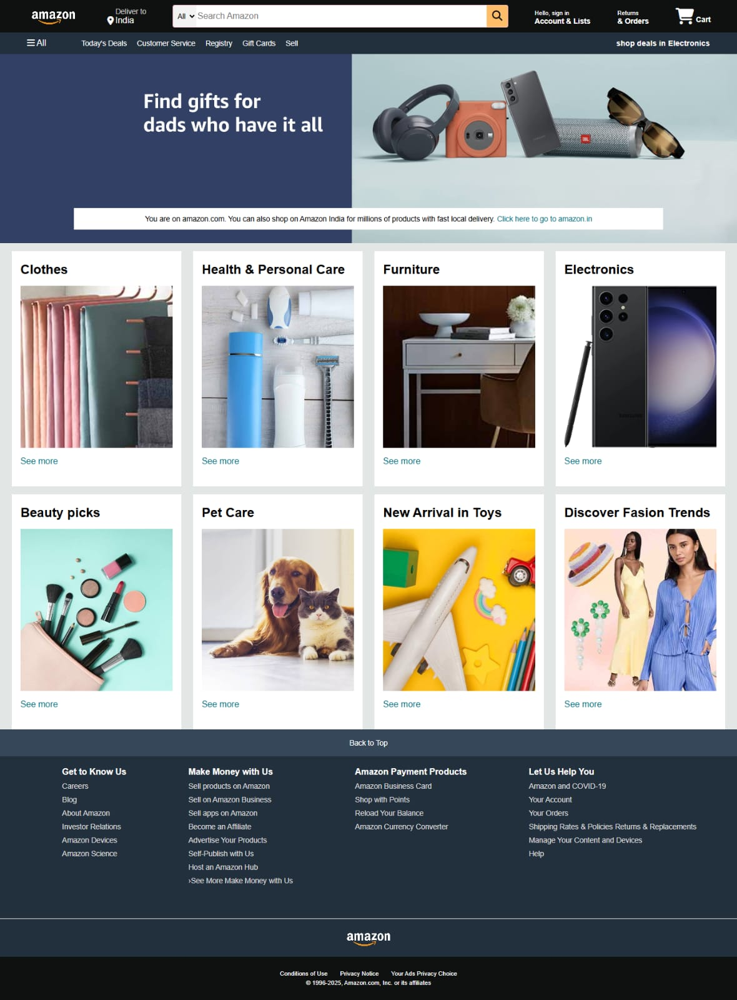

# 🛒 Amazon Homepage Clone

A responsive Amazon homepage clone created using HTML and CSS.

## 📌 Overview

This project recreates the visual layout of an Amazon-style shopping
homepage. It includes a navigation bar, search section, hero banner,
product categories, and footer.

## 🖥️ Application Preview



## ✨ Features

- Amazon-style navigation bar
- Location and account sections
- Search bar
- Hero banner
- Product/category cards
- Multiple shopping categories
- Footer with navigation sections
- Responsive layout
- Font Awesome icons

## 🛠️ Technologies Used

- HTML5
- CSS3
- Font Awesome

## 📂 Project Structure

```text
amazon-homepage-clone/
│
├── index.html
├── style.css
│
└── images/
    ├── amazon_logo.png
    ├── hero_image.jpg
    ├── box1_image.jpg
    ├── box2_image.jpg
    ├── box3_image.jpg
    ├── box4_image.jpg
    ├── box5_image.jpg

▶️ How to Run

Clone or download this repository.
Open the project folder.
Open index.html in a web browser.

🎯 Learning Outcomes

Understanding HTML page structure
Creating layouts using CSS Flexbox
Working with background images
Creating navigation and footer sections
Using external icon libraries
Organizing website assets

🔮 Future Improvements

Add JavaScript functionality
Make the search bar functional
Add product pages
Add shopping cart functionality
Improve mobile responsiveness

👩‍💻 Author

Prapti Patil

Computer Engineering Student | Aspiring Software Developer

GitHub | LinkedIn
    ├── box6_image.jpg
    ├── box7_image.jpg
    └── box8_image.jpg
